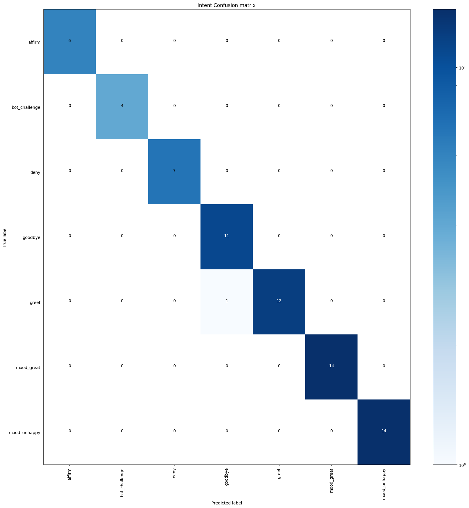
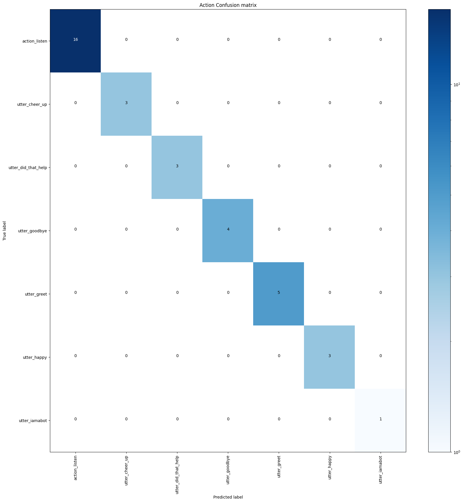

## RESULTADOS DO TREINAMENTO

### 1. Intent

#### 1.1. Performance Geral

Métrica | Valor
--- | ---
Acurácia | 98.55%
Precisão (Macro) | 98.81%
Recall (Macro) | 98.90%
Recall (Macro) | 98.90%
Precisão (Ponderado) | 98.67%
Recall (Ponderado) | 98.55%
F1-Score (Ponderado) | 98.55%

#### 1.2. Performance por fintent

Intent | Precisão | Recall | F1-Score | # Exemplos | % Exemplos
--- | --- | --- | --- | --- | ---
goodbye | 91.67% | 42.00% | 95.65% | 11 | 16%
greet | 100.00% | 92.31% | 96.00% | 13 | 19%
affirm | 100.00% | 100.00% | 100.00% | 6 | 9%
bot_challenge | 100.00% | 100.00% | 100.00% | 4 | 6%
mood_unhappy | 100.00% | 100.00% | 100.00% | 14 | 20%
mood_great | 100.00% | 100.00% | 100.00% | 14 | 20%
deny | 100.00% | 100.00% | 100.00% | 7 | 10%

##### Matriz de confusão

### 2. Story

#### 2.1. Performance Geral

Métrica | Valor
--- | ---
Acurácia | 100.00%
Precisão (Macro) | 100.00%
Recall (Macro) | 100.00%
Recall (Macro) | 100.00%
Precisão (Ponderado) | 100.00%
Recall (Ponderado) | 100.00%
F1-Score (Ponderado) | 100.00%
Acurácia da Conversa | 100.00%

#### 1.2. Performance por fstory

Story | Precisão | Recall | F1-Score | # Exemplos | % Exemplos
--- | --- | --- | --- | --- | ---
action_listen | 100.00% | 100.00% | 100.00% | 16 | 31%
utter_happy | 100.00% | 100.00% | 100.00% | 3 | 6%
goodbye | 100.00% | 100.00% | 100.00% | 2 | 4%
greet | 100.00% | 100.00% | 100.00% | 5 | 10%
affirm | 100.00% | 100.00% | 100.00% | 1 | 2%
utter_did_that_help | 100.00% | 100.00% | 100.00% | 3 | 6%
utter_cheer_up | 100.00% | 100.00% | 100.00% | 3 | 6%
bot_challenge | 100.00% | 100.00% | 100.00% | 1 | 2%
utter_goodbye | 100.00% | 100.00% | 100.00% | 4 | 8%
utter_greet | 100.00% | 100.00% | 100.00% | 5 | 10%
mood_unhappy | 100.00% | 100.00% | 100.00% | 3 | 6%
mood_great | 100.00% | 100.00% | 100.00% | 2 | 4%
deny | 100.00% | 100.00% | 100.00% | 2 | 4%
utter_iamabot | 100.00% | 100.00% | 100.00% | 1 | 2%

##### Matriz de confusão

